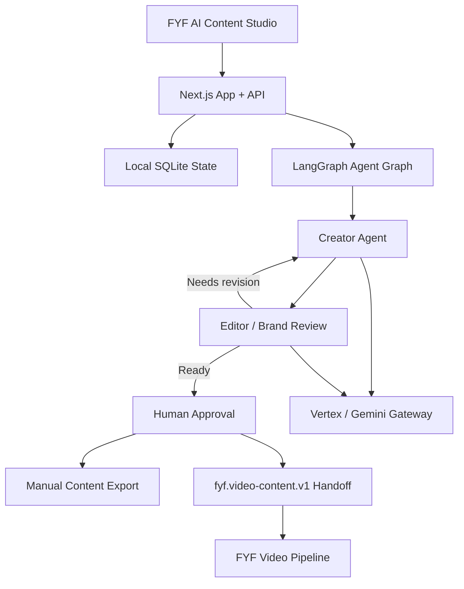

# FYF AI Content Studio

Local-first workspace for turning FYF brand ideas into reviewed Burmese content and approved video handoffs.

> [!NOTE]
> **Current Status:** Public FYF Studio snapshot — local-first runtime, brand context, human review gates, and manual export only. Hosted deployment is a separate pending step.
> Phase 0B (DB/Auth Connection Spike) is **not authorized** and has not been started.

> [!WARNING]
> **Release boundary**
> This public snapshot excludes credentials, local databases, generated output, and private development history. Hosted auth/storage and automatic publishing are not enabled.

## Repository boundary

Any public release requires sanitized history and approved content. Do not commit credentials, local SQLite databases, generated output, or production tokens. The future `fyf-video-pipeline` integration remains a separate repository and connects through an explicit reviewed contract rather than copying code or local data across repos.

---

## Purpose

**FYF AI Content Studio** is a local-first workspace for producing clear Burmese content from FYF brand guidance. It turns a concrete idea into a reviewed draft, applies deterministic brand and risk checks, and stops for human approval before anything is exported or sent to the video pipeline.

- **Brand-led:** Writing and visual direction come from the FYF brand context and approved guidance.
- **Graph-based:** A small agent graph coordinates creation, review, and bounded revision.
- **Human-controlled:** A human reviewer approves the final content before export.
- **Manual publishing:** Facebook export and post tracking remain operator actions; automatic publishing is not enabled.

This repository is FYF-only. External client systems and automation workflows are outside this runtime and must not be called or modified here. Legacy compatibility names may remain in local adapters while the migration is completed.

## What this product is built to operate

- The FYF content loop across Create, Content Planner, Review, Analytics, and Brand/References.
- FYF brand context, approved voice, visual direction, and content guidance.
- Human approval gates before manual export or post tracking; no automatic Facebook publishing.
- Local persistence, validation, workspace isolation, revision history, and analytics deduplication.
- The approved-content handoff from the FYF Studio to the separate FYF Video Pipeline through `fyf.video-content.v1`.

## Current FYF build vs. production path

The current real-use-case build is intentionally local-first while the production path is reviewed:

| Area | Current FYF build | Future reviewed path |
| --- | --- | --- |
| Storage | Local SQLite with workspace-scoped state | Durable production store after a separate approval |
| AI | Vertex boundary with a safe local route | Vertex/Gemini runtime with measured credentials and quotas |
| Publishing | Manual export and operator tracking | Explicitly reviewed publishing integration |
| Video | Separate `fyf-video-pipeline` repository | Versioned content/video contract; no code or data copying |

## FYF Studio → Video Pipeline

The FYF Studio owns brand context, writing, review, and approval. The separate FYF Video Pipeline owns voice, visuals, motion, and final video rendering. After a human reviewer approves a draft, the local API exposes a minimal, typed handoff:

```text
GET /api/workspaces/{workspaceId}/drafts/{draftId}/video-contract?voice=ai|victor|dual
```

The endpoint is implemented locally and returns only approved script text, FYF brand rules, selected voice mode, and approval metadata. It refuses drafts that are not approved and never includes credentials, local file paths, SQLite payloads, or provider tokens. Automated cross-repository execution remains deferred; the separate renderer consumes this contract when that integration is explicitly approved.

---

## Architecture graph



## Tech stack

- **Frontend:** Next.js App Router, React, TypeScript
- **Agent graph:** LangGraph.js — Creator → Editor → bounded revision loop
- **AI runtime:** Google Vertex AI / Gemini through the AI SDK gateway
- **Local state:** SQLite with Node.js `node:sqlite`
- **Visual output:** Deterministic SVG/PNG banner engine
- **Testing:** Vitest, ESLint, TypeScript, Playwright
- **Video pipeline:** Separate FYF video renderer consuming the approved `fyf.video-content.v1` contract

---

## Canonical Documentation Links

- [Architecture Overview](docs/architecture.md)
- [Product Decisions Log](docs/product-decisions.md)
- [Codebase Audit & Inventory](docs/codebase-audit.md)
- [Historical Hosted V1 Component Contract & Workflow State Machine (deferred)](docs/workflow-contract.md)
- [Historical Hosted Agent & Bounded Tool Catalog (deferred)](docs/tool-catalog.md)
- [Historical Hosted Data Model (deferred)](docs/data-model.md)
- [Security Architecture & Threat Model](docs/security.md)
- [Approved Video Content Contract](docs/video-content-contract.md)
- [Historical Evaluation & Testing Strategy](docs/testing.md)
- [Historical Verification Ledger](docs/verification-ledger.md)
- [Historical Handoff Report](docs/handoff.md)

---

## Development & Verification Commands

### Setup

Requires Node.js 22 or newer. Copy `.env.example` to `.env.local` only when you need local configuration; keep real values out of Git.

```bash
npm ci
npm run dev
```

Open `http://localhost:3000` for the local studio.

### Verification Suite
```bash
# Code linting
npm run lint

# TypeScript typechecking
npm run typecheck

# Unit & contract tests
npm test

# Production build
npm run build

# Evaluation fixtures JSON validation
node -e "JSON.parse(require('fs').readFileSync('docs/eval-fixtures.json','utf8')); console.log('valid')"
```
