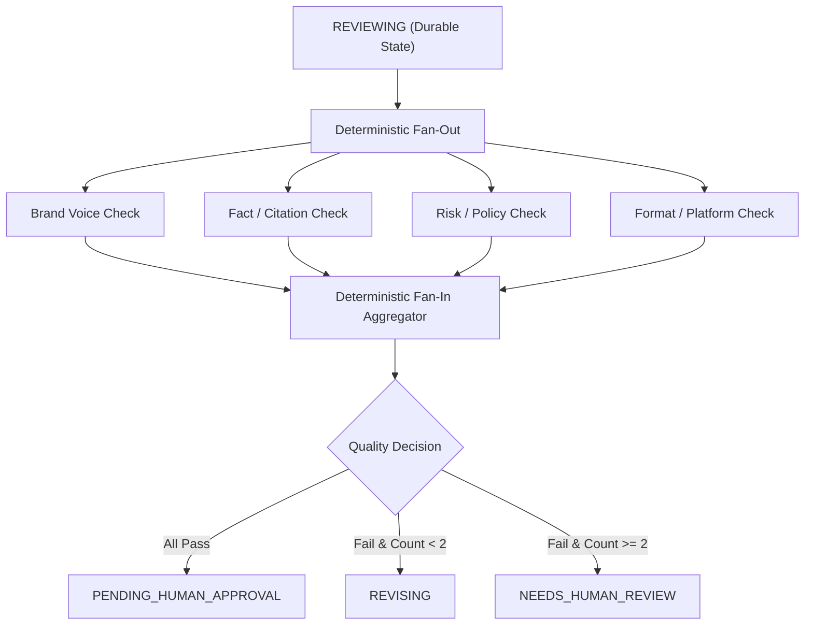

# V1 Component Contract & Workflow State-Machine Specification

**Project:** FYF AI Content Studio (`fyf-ai-content-studio`)
**Status:** Architecture Specification
**Scope:** V1 Production Component Boundaries & Durable State Machine Contract

---

## 1. Executive Summary

This document preserves the earlier hosted-workflow contract as a deferred design reference for FYF AI Content Studio. The current runtime is local-first and uses the smaller Studio → approval → video-handoff flow described in the root README.

---

## 2. Component Boundaries

### Boundary 1: Next.js Control Panel ➔ Command API
- **Caller:** Web Browser / Next.js Control Panel (Operator / Human Approver)
- **Receiver:** Next.js Server Actions / Command API (`POST /api/commands/*`)
- **Authentication:** Server-side authenticated session cookie / JWT
- **Input:** JSON command payload (`{ workspaceId, commandType, idempotencyKey, expectedStateVersion, payload }`)
- **Authorization:** Derive user identity from authenticated server-side session; derive and verify workspace membership server-side. Never trust a caller-supplied `workspaceId` header as authorization. Unauthorized cross-workspace access returns HTTP 403 without revealing resource existence.
- **Idempotency:** Idempotency scope `(workspace_id, command_type, idempotency_key)` with `request_hash`. Same key + same request hash returns the stored result/reference without re-execution. Same key + different request hash returns HTTP 409 Conflict. Command results remain replayable for the configured retention period.
- **Persistence:** App DB (`workflow_commands`, `audit_events`)
- **Timeout Owner:** Next.js API Route / Server Action handler timeout
- **Retry Owner:** Client UI retry / Operator manual submission
- **Failure Behavior:** Return HTTP 400 (Validation), 401 (Unauthenticated), 403 (Unauthorized), 409 (Conflict), or 500 (Internal Error)
- **Safe Audit Evidence:** Log sanitized event to `audit_events` (action, workspace_id, actor, correlation_id; no raw prompts or secrets)

### Boundary 2: Command API ➔ PostgreSQL Transaction
- **Caller:** Next.js Command API
- **Receiver:** PostgreSQL Application Database (App ORM / Drizzle)
- **Authentication:** Server-environment database credentials
- **Input:** SQL queries / ORM mutations executed within a single database transaction
- **Authorization:** Server-side authenticated workspace context
- **Idempotency:** Atomic database transaction boundaries (`UPDATE workflow_runs WHERE version = expectedStateVersion`)
- **Persistence:** Atomic write to `workflow_runs`, `workflow_commands` (`PENDING_ENQUEUE`), and `audit_events`
- **Timeout Owner:** Database statement / transaction timeout
- **Retry Owner:** Automatically retry only a complete idempotent transaction when PostgreSQL definitively reports a serialization failure or deadlock before a successful commit is acknowledged. A connection loss with uncertain commit outcome must not be blindly retried. The client/API replays the same idempotency key and request hash to reconcile the stored command result.
- **Failure Behavior:** Transaction rollback on error; HTTP 500 returned to caller
- **Safe Audit Evidence:** Transaction audit log with correlation ID

### Boundary 3: Durable Outbox Dispatcher ➔ Google Cloud Tasks
- **Caller:** Background Outbox Dispatcher
- **Receiver:** Google Cloud Tasks API
- **Authentication:** GCP Service Account Application Default Credentials (IAM)
- **Input:** Post-commit `workflow_commands` in `PENDING_ENQUEUE` state with deterministic task identity (`task-{workspaceId}-{commandId}`)
- **Authorization:** Internal Service Account IAM permissions (`roles/cloudtasks.enqueuer`)
- **Idempotency:** Deterministic Cloud Task identity (`task-{workspaceId}-{commandId}`). If Cloud Tasks returns `ALREADY_EXISTS`, verify it maps to the same stored command and task name, treat as idempotent success, and transition command state to `ENQUEUED`. Never create a differently named duplicate task.
- **Persistence:** `workflow_commands.status` updated from `PENDING_ENQUEUE` to `ENQUEUED`
- **Timeout Owner:** Outbox Dispatcher gRPC / HTTP request timeout
- **Retry Owner:** Outbox Dispatcher loop (redispatches commands safely remaining in `PENDING_ENQUEUE`)
- **Failure Behavior:** Command remains in `PENDING_ENQUEUE` for reconciler pickup if transient Cloud Tasks error occurs
- **Safe Audit Evidence:** Enqueue audit log with command ID and deterministic task name

### Boundary 4: Google Cloud Tasks ➔ Private Cloud Run Worker
- **Caller:** Google Cloud Tasks Queue
- **Receiver:** Private Cloud Run Agent Worker (`POST /internal/worker/execute`)
- **Authentication:** OIDC Bearer Token signed by Cloud Tasks Service Account, verified by Cloud Run IAM
- **Input:** JSON push payload (`{ workflowRunId, commandId, commandType, expectedStateVersion, idempotencyKey, traceCorrelationId }`)
- **Authorization:** Cloud Run Invoker IAM role (`roles/run.invoker`)
- **Idempotency:** Worker performs compare-and-swap atomic claim (`UPDATE workflow_commands SET status = 'CLAIMED', worker_lease_expires_at = ... WHERE id = ... AND status = 'ENQUEUED'`). Stale or duplicate delivery returns HTTP 200 OK no-op.
- **Persistence:** `workflow_commands.status = 'CLAIMED'`, `workflow_runs.version` updated
- **Timeout Owner:** Bounded HTTP request deadline per Cloud Run invocation (must safely exceed the longest permitted graph segment)
- **Retry Owner:** Cloud Tasks exponential backoff retry policy (for HTTP 5xx / 429 errors)
- **Failure Behavior:** Application failure updates DB to `FAILED` or `NEEDS_ATTENTION` and returns 200 OK to prevent Cloud Tasks infinite retries; infrastructure errors return 500 to trigger queue backoff
- **Safe Audit Evidence:** Worker invocation log with correlation ID, execution duration, and final state

### Boundary 5: Worker/LangGraph ➔ PostgreSQL Checkpointer
- **Caller:** LangGraph.js Engine inside Agent Worker
- **Receiver:** LangGraph PostgreSQL Checkpointer (`@langchain/langgraph-checkpoint-postgres`)
- **Authentication:** Dedicated database connection pool credentials
- **Input:** Thread ID, Checkpoint ID, state channel blobs, checkpoint writes
- **Authorization:** Server-side internal worker process
- **Idempotency:** Thread ID + Checkpoint ID uniqueness constraints
- **Persistence:** Writes to `checkpoints`, `checkpoint_blobs`, and `checkpoint_writes`
- **Timeout Owner:** Database connection / query timeout
- **Retry Owner:** LangGraph internal checkpointer retry mechanism
- **Failure Behavior:** Exception thrown, worker halts execution, run transitions to `NEEDS_ATTENTION`
- **Safe Audit Evidence:** Checkpoint write log with thread ID and checkpoint ID

### Boundary 6: Worker ➔ LiteLLM Proxy
- **Caller:** LangGraph Node Agent Code inside Worker
- **Receiver:** LiteLLM Proxy Gateway (`http://litellm-proxy:4000/v1/chat/completions`)
- **Authentication:** A restricted, service-scoped LiteLLM virtual key issued only to the FYF AI Worker. The Worker must never receive the LiteLLM administrative/master key. The virtual key permits only approved V1 role aliases and cannot configure providers, create keys, access admin endpoints, or enable fallback providers.
- **Input:** OpenAI-compatible Chat Completions payload (model alias, messages, temperature, max_tokens, correlationId)
- **Authorization:** Worker internal process authorized by restricted virtual key
- **Idempotency:** `model_call_attempts` table tracks attempt state prior to transmission (`RESERVED` ➔ `IN_FLIGHT`). LiteLLM automatic provider retries are disabled in V1 to avoid stacked retries. Single retry ownership is held by the Worker.
- **Persistence:** Records created in `model_call_attempts`, `budget_reservations`, and `usage_ledger`
- **Timeout Owner:** Worker HTTP client per-node timeout
- **Retry Owner:** Worker application model-call attempt lifecycle. Retry allowed ONLY when system proves no request bytes were transmitted or provider definitively rejected execution before generation. Timeout or disconnect after possible transmission becomes `OUTCOME_UNKNOWN` (never automatically duplicated; requires reconciliation or transition to `NEEDS_ATTENTION`).
- **Failure Behavior:** Pre-transmission failure retried once by Worker; post-transmission error sets attempt to `OUTCOME_UNKNOWN` and run to `NEEDS_ATTENTION`
- **Safe Audit Evidence:** `usage_ledger` written with token counts, latency, requested alias, actual Vertex model ID, and correlation ID (no raw prompts or completion bodies)

### Boundary 7: LiteLLM Proxy ➔ Vertex AI/Gemini
- **Caller:** LiteLLM Proxy Gateway
- **Receiver:** Google Cloud Vertex AI Publisher Models API (the Phase 3 approved Vertex AI regional endpoint). The exact region remains unset until Phase 3 verifies: Gemini model availability, lifecycle status, pricing, latency, and data-residency requirements.
- **Authentication:** GCP Service Account Application Default Credentials (ADC)
- **Input:** Vertex AI REST / gRPC completion request
- **Authorization:** Service Account IAM role (`roles/aiplatform.user`)
- **Idempotency:** Provider-side request correlation ID tracking
- **Persistence:** GCP Cloud Logging / Vertex AI usage metrics (GCP side)
- **Timeout Owner:** LiteLLM Proxy upstream timeout
- **Retry Owner:** LiteLLM provider retries are DISABLED in V1 to avoid stacked retries with Worker. Vertex is the exclusive V1 provider (no fallback provider).
- **Failure Behavior:** Provider errors (4xx/5xx) mapped to HTTP status code returned to Worker
- **Safe Audit Evidence:** LiteLLM proxy log with provider request ID, model ID, latency, and status

### Boundary 8: Worker ➔ Provider-Neutral ResearchProvider
- **Caller:** Agent Worker Research Node
- **Receiver:** `ResearchProvider` Interface (`ResearchProvider.search(query, constraints)` / `ResearchProvider.fetch(sourceUrl, constraints)`)
- **Authentication:** Provider-specific server-side credentials retrieved through the approved secret/identity mechanism when authentication is required. Credentials are never exposed to the LLM, browser, research content, or audit logs.
- **Input:** Search query or source URL with safety constraints
- **Authorization:** Internal Worker process
- **Idempotency:** Query Hash caching in `research_cache`
- **Persistence:** Cached results stored in `research_cache` with source URL and retrieval timestamp
- **Timeout Owner:** Worker Research Node timeout
- **Retry Owner:** Research Node single retry on network connect failure
- **Failure Behavior:** SSRF validation enforced before connection and after every redirect (approved HTTPS destinations, bounded response size/timeout). Fetched content treated as untrusted data. If research is not required, skip deterministically. If required research succeeds and sources validate, continue. If required research fails, sources are untrusted, or citation validation fails, transition workflow to `NEEDS_ATTENTION`. Never silently fall back to unsupported factual generation.
- **Safe Audit Evidence:** Research audit log with query hash, target domain, fetch timestamp, and validation status

### Boundary 9: Human Approval UI ➔ Command API
- **Caller:** Operator Web Browser (Human Approver)
- **Receiver:** Next.js Command API (`POST /api/commands/approve`)
- **Authentication:** Server-side authenticated session cookie
- **Input:** Approval command payload (`{ workspaceId, workflowRunId, expectedDraftVersionId, expectedDraftVersion, expectedStateVersion, decision: 'approve' | 'revise' | 'cancel', feedback? }`)
- **Authorization:** Server-side session verification for workspace operator/owner role
- **Idempotency:** Idempotency key + `request_hash` scope `(workspace_id, command_type, idempotency_key)`
- **Persistence:** Inserts into `human_approvals`, updates `workflow_runs.status`
- **Timeout Owner:** Next.js Server Action timeout
- **Retry Owner:** Operator UI retry / manual submission
- **Failure Behavior:** Reject with 409 if draft identity/version belongs to another run, is mismatched or stale, or `expectedStateVersion` is stale; return 403 if unauthorized
- **Safe Audit Evidence:** Audit log entry with approver user ID, draft version, decision type, and timestamp

### Boundary 10: Manual Export UI/API ➔ Export Packager
- **Caller:** Operator Web Browser (Human Approver)
- **Receiver:** Next.js Export API (`POST /api/commands/export`)
- **Authentication:** Server-side authenticated session cookie
- **Input:** Export request (`{ workspaceId, workflowRunId, expectedDraftVersionId, expectedDraftVersion, expectedStateVersion }`)
- **Authorization:** Server-side workspace authorization
- **Idempotency:** Content hash verification + `export_records` uniqueness
- **Persistence:** Creates record in `export_records` with `draft_version_id`, `draft_version`, `content_hash`, `exporter_id`, and timestamp
- **Timeout Owner:** API Route timeout
- **Retry Owner:** Operator manual UI action
- **Failure Behavior:** Accepts ONLY when `workflow_runs.status = READY_FOR_EXPORT`. Rejects with 400/409 if status is `APPROVED` before export validation finishes, draft version is stale, content hash changed, hard safety gate failed, or actor is unauthorized. Manual export only (no Facebook API posting or automatic publishing).
- **Safe Audit Evidence:** Audit log entry with export record ID, content hash, exporter ID, and timestamp

### Boundary 11: Background Reconciler ➔ PostgreSQL, Cloud Tasks Evidence, & LiteLLM Evidence
- **Caller:** Scheduled Background Reconciliation Job / Cron
- **Receiver:** PostgreSQL DB, Cloud Tasks API, LiteLLM Proxy / Usage Evidence
- **Authentication:** System Service Account credentials
- **Input:** Database query for stale commands/runs + external state evidence
- **Authorization:** System background worker authority
- **Idempotency:** Atomic compare-and-swap state updates (`WHERE version = expectedVersion`)
- **Persistence:** Updates `workflow_commands`, `workflow_runs.status`, `model_call_attempts`, and writes to `audit_events`
- **Timeout Owner:** Reconciler job execution timeout
- **Retry Owner:** Next scheduled reconciler run
- **Failure Behavior:** Covers stale `PENDING_ENQUEUE` (redispatches if safe), exhausted Cloud Tasks delivery, expired command/worker leases, abandoned active runs, `OUTCOME_UNKNOWN` model calls, and checkpoint/version incompatibilities. Uses compare-and-swap checks. Records sanitized audit evidence without logging prompts, secrets, tokens, or raw research bodies. Never blindly repeats a paid model call. Moves unresolved work to `NEEDS_ATTENTION`. Requires explicit operator replay after safe verification.
- **Safe Audit Evidence:** Reconciliation log entry with correlation ID, command ID, previous state, new state, and resolution cause

---

## 3. Authorization Contract

For all browser and API commands:
- User identity is derived strictly from the authenticated server-side session.
- Workspace membership is derived and verified server-side.
- Caller-supplied `workspaceId` headers are never trusted as authorization.
- Every command payload must include `expectedStateVersion`.
- Unauthorized cross-workspace access attempts return HTTP 403 Forbidden without revealing whether the resource exists.

---

## 4. Command Idempotency Contract

- **Idempotency Scope:** `(workspace_id, command_type, idempotency_key)`
- **Request Hash:** `request_hash` is computed and stored alongside the key.
- **Replay Policy:**
  - Same key + same request hash: returns the stored result/reference without re-execution.
  - Same key + different request hash: returns HTTP 409 Conflict.
- Arbitrary 24-hour duplicate rejection rules are prohibited. Command results remain replayable for the command’s configured retention period.

---

## 5. Durable Outbox Contract

The Command API must not create a workflow run and then directly rely on a non-transactional Cloud Tasks enqueue.

Within one PostgreSQL transaction:
1. Authorize command.
2. Validate `expectedStateVersion`.
3. Create or update workflow state.
4. Create `workflow_commands` entry.
5. Set command state to `PENDING_ENQUEUE`.
6. Store deterministic task identity (`task-{workspaceId}-{commandId}`).
7. Write safe audit event.

The outbox dispatcher creates the Cloud Task after transaction commit.

Command Lifecycle States:
- `PENDING_ENQUEUE`
- `ENQUEUED`
- `CLAIMED`
- `COMPLETED`
- `FAILED`
- `STALE`
- `NEEDS_ATTENTION`

Cloud Task identity must be deterministic (`task-{workspaceId}-{commandId}`). If Cloud Tasks returns `ALREADY_EXISTS`, verify it maps to the same stored command and task name, treat it as idempotent success, and never create a differently named duplicate task.

The background reconciler may redispatch only commands still safely in `PENDING_ENQUEUE`.

---

## 6. Model-Call Retry Ownership & Provider-Neutral Research

### Single Model-Call Retry Ownership
Stacked retries are prohibited.
- For V1, the Worker owns the application model-call attempt lifecycle.
- LiteLLM automatic provider retries are disabled unless Phase 3 explicitly verifies and approves a non-stacking policy.
- Vertex AI/Gemini is the exclusive V1 provider (no fallback provider).

Attempt Lifecycle:
`RESERVED` ➔ `IN_FLIGHT` ➔ `SUCCEEDED` | `FAILED_CONFIRMED` | `OUTCOME_UNKNOWN` ➔ `RECONCILED`

Retry Rule:
- Retry is allowed ONLY when the system proves no request bytes were transmitted or the provider definitively rejected execution before generation.
- Timeout or disconnect after possible transmission becomes `OUTCOME_UNKNOWN`.
- `OUTCOME_UNKNOWN` never triggers an automatic duplicate paid call.
- Reconciliation uses correlation ID, LiteLLM evidence, provider request ID, and usage evidence.
- If outcome cannot be proven, transition workflow to `NEEDS_ATTENTION`.

### Provider-Neutral Research
- Research provider selection remains pending.
- Interface definition:
  - `ResearchProvider.search(query, constraints)`
  - `ResearchProvider.fetch(sourceUrl, constraints)`
- Security requirements: approved HTTPS destinations only, SSRF validation before connection and after every redirect, bounded response size, bounded timeout, source URL and retrieval timestamp retained, fetched content treated as untrusted data, factual claims linked to retained sources.
- Behavior:
  - If research is not required, skip deterministically (`READY_FOR_STRATEGY → STRATEGIZING`).
  - If required research succeeds and sources validate, continue (`RESEARCHING → STRATEGIZING`).
  - If required research fails, sources are untrusted, or citation validation fails, transition workflow to `NEEDS_ATTENTION`.
  - Never silently fall back to unsupported factual generation.

---

## 7. Business States List (16 States)

The `workflow_runs.status` field uses 16 business statuses:

1. `BRIEF_SUBMITTED`
2. `VALIDATING`
3. `READY_FOR_STRATEGY`
4. `RESEARCHING`
5. `STRATEGIZING`
6. `DRAFTING`
7. `REVIEWING`
8. `REVISING`
9. `PENDING_HUMAN_APPROVAL`
10. `NEEDS_HUMAN_REVIEW`
11. `APPROVED`
12. `READY_FOR_EXPORT`
13. `EXPORTED`
14. `FAILED`
15. `NEEDS_ATTENTION`
16. `CANCELLED`

Do not introduce unapproved or additional review checks as durable statuses.

---

## 8. Durable State Transitions

### Normal Workflow Transitions
- `[*] → BRIEF_SUBMITTED`
- `BRIEF_SUBMITTED → VALIDATING`
- `VALIDATING → READY_FOR_STRATEGY` (when required fields and budget check pass)
- `VALIDATING → FAILED` (when schema invalid or budget policy exceeded)
- `READY_FOR_STRATEGY → RESEARCHING` (when fresh factual research is required)
- `READY_FOR_STRATEGY → STRATEGIZING` (when research is not required)
- `RESEARCHING → STRATEGIZING` (only after source and citation validation)
- `RESEARCHING → NEEDS_ATTENTION` (when required research fails)
- `STRATEGIZING → DRAFTING`
- `DRAFTING → REVIEWING`
- `REVIEWING → PENDING_HUMAN_APPROVAL` (when deterministic aggregation accepts all required checks)
- `REVIEWING → REVISING` (when revision is allowed and revision count is below 2)
- `REVIEWING → NEEDS_HUMAN_REVIEW` (when revision limit is reached or automated resolution is unsafe)
- `REVISING → REVIEWING` (after a new immutable draft version is stored)
- `PENDING_HUMAN_APPROVAL → APPROVED` (only for the exact current draft version)
- `PENDING_HUMAN_APPROVAL → REVIEWING` (when the human directly edits content; create a new version and rerun checks)
- `PENDING_HUMAN_APPROVAL → REVISING` (when the human rejects with revision feedback)
- `PENDING_HUMAN_APPROVAL → CANCELLED`
- `NEEDS_HUMAN_REVIEW → REVIEWING` (after a human edit creates a new version)
- `NEEDS_HUMAN_REVIEW → APPROVED` (only with explicit owner override, exact current version, and all deterministic hard safety gates passing)
- `NEEDS_HUMAN_REVIEW → CANCELLED`
- `APPROVED → READY_FOR_EXPORT` (after deterministic export validation)
- `READY_FOR_EXPORT → EXPORTED` (after the operator performs manual export)
- `READY_FOR_EXPORT → REVIEWING` (if the operator edits content before export)

### Recovery & Forbidden Transitions
- Direct transition to human approval from unresolved attention states is strictly prohibited.
- Recovery from `NEEDS_ATTENTION` must:
  1. Verify the last durable checkpoint.
  2. Verify uncertain external outcomes.
  3. Create an explicit manual replay command.
  4. Resume only at a documented safe active state.
  5. Never skip validation or review.

---

## 9. Parallel Review Design

`REVIEWING` is the single durable business state for quality review.

Inside `REVIEWING`, four ephemeral checks run in parallel against the exact same immutable draft version:
- Brand Voice Check
- Fact/Citation Check
- Risk/Policy Check
- Format/Platform Check

Rules:
- Checks run in parallel ONLY because they read the same immutable version.
- Every result includes workflow run ID, draft version, reviewer role, and result schema version.
- Aggregator rejects missing, duplicate, stale-version, or malformed results.
- The LLM cannot decide the state transition.
- Deterministic code chooses: `PENDING_HUMAN_APPROVAL`, `REVISING`, or `NEEDS_HUMAN_REVIEW`.

---

## 10. Export Contract

- The manual export endpoint accepts ONLY runs where `workflow_runs.status = READY_FOR_EXPORT`.
- The export endpoint MUST reject:
  - Runs prior to export validation completion
  - Stale draft versions
  - Changed content hash
  - Failed hard safety gates
  - Unauthorized actors
- Export is manual only. No Facebook API posting, scheduled publishing, or automatic social media dispatch.

---

## 11. Terminal Error Policy & State Eligibility

Wildcard state transition rules are prohibited.

Active states eligible for transition to `FAILED`:
- `BRIEF_SUBMITTED`
- `VALIDATING`
- `READY_FOR_STRATEGY`
- `RESEARCHING`
- `STRATEGIZING`
- `DRAFTING`
- `REVIEWING`
- `REVISING`

Active states eligible for transition to `NEEDS_ATTENTION`:
- `PENDING_ENQUEUE` command reconciliation failure
- Uncertain model-call outcome (`OUTCOME_UNKNOWN`)
- Required research failure
- Cloud Tasks retry exhaustion
- Checkpoint/version incompatibility
- Abandoned worker lease

Terminal States (cannot resume):
- `EXPORTED`
- `FAILED`
- `CANCELLED`

---

## 12. Timeout Policy

Numeric timeouts are not invented in Phase 0A. Final numeric timeouts will be pinned after measured Phase 2/3 spike evidence.

Timeout Ownership per Boundary:
- **Boundary 1 (Control Panel ➔ Command API):** Next.js API Route / Server Action handler timeout
- **Boundary 2 (Command API ➔ PostgreSQL Transaction):** Database statement / transaction timeout
- **Boundary 3 (Outbox Dispatcher ➔ Cloud Tasks):** Outbox Dispatcher gRPC / HTTP request timeout
- **Boundary 4 (Cloud Tasks ➔ Cloud Run Worker):** Bounded HTTP request deadline per Cloud Run invocation
- **Boundary 5 (Worker ➔ Checkpointer):** Database connection / query timeout
- **Boundary 6 (Worker ➔ LiteLLM Proxy):** Worker HTTP client per-node timeout
- **Boundary 7 (LiteLLM Proxy ➔ Vertex AI):** LiteLLM Proxy upstream timeout
- **Boundary 8 (Worker ➔ ResearchProvider):** Worker Research Node timeout
- **Boundary 9 (Human Approval ➔ Command API):** Next.js Server Action timeout
- **Boundary 10 (Export UI ➔ Export Packager):** Next.js Export API Route timeout
- **Boundary 11 (Background Reconciler):** Reconciler job execution timeout

The outer Cloud Tasks / Cloud Run request deadline must safely exceed the longest permitted bounded graph segment.

---

## 13. Document Consistency Verification

This document satisfies all required consistency criteria:
- Contains 11 boundary headings.
- Contains 16 durable business statuses.
- Provider-neutral research specified.
- No silent research fallback.
- No unapproved durable statuses.
- Single retry ownership enforced (no stacked Worker/LiteLLM retries).
- Export restricted to `READY_FOR_EXPORT`.
